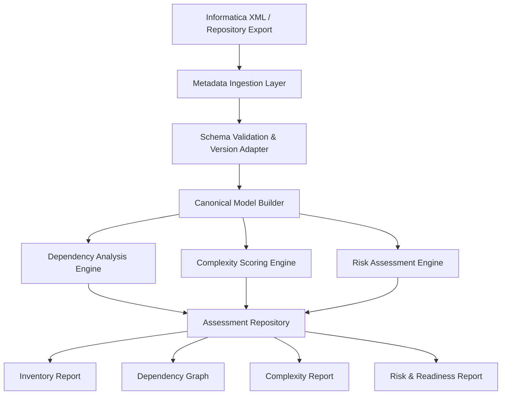

# X2XAnalyzer Proposal  
## Informatica Workload Assessment for Pentaho Migration

## 1. Executive Summary

X2XAnalyzer 係 Travinto migration framework 入面嘅第一個核心模組，目標係喺正式轉換之前，全面分析現有 Informatica 環境，協助客戶清楚掌握現況、識別高風險項目、評估可自動化程度，並制定合理嘅 migration roadmap。

對管理層嚟講，X2XAnalyzer 提供嘅價值唔單止係技術盤點，更重要係：

- 提供清晰 migration scope
- 提前識別高風險工作流同複雜 ETL 邏輯
- 評估自動化轉換比例
- 支持 migration phase / wave planning
- 降低項目不確定性同 execution risk

---

## 2. Business Objective

X2XAnalyzer 嘅主要商業目標包括：

- 建立完整 Informatica 資產清單
- 評估 migration complexity 同 technical debt
- 識別 custom logic、unsupported pattern 同 integration risk
- 輸出可執行 migration plan
- 為 X2XConverter 同 X2XValidator 提供標準化輸入模型

---

## 3. Scope of Analysis

分析範圍包括但不限於：

- Mappings
- Mapplets
- Workflows
- Worklets
- Sessions
- Tasks
- Source / Target Definitions
- Transformations
- Connectors / Links
- Parameters / Variables
- Pre-SQL / Post-SQL
- Session Properties
- Connection Metadata
- Reusable Objects
- External Script / Command Integration

---

## 4. Input

### 4.1 Required Input

- Informatica repository export / XML export
- Informatica object metadata
- Folder / project structure
- Session / workflow definitions
- Transformation definitions
- Parameter files / variable definitions
- Source / target metadata
- Connection metadata

### 4.2 Optional Input

- Informatica version information
- Historical execution logs
- Job runtime statistics
- Source/target schema metadata
- Custom transformation specifications
- Available business rules documentation

---

## 5. Processing Approach

### 5.1 Metadata Ingestion

系統首先讀取 Informatica XML / repository export，並根據版本差異進行 schema-aware parsing。

處理內容包括：

- XML parsing
- Schema validation
- Object extraction
- Reference resolution
- Cross-object dependency resolution

### 5.2 Canonical Model Normalization

為咗避免直接依賴 vendor-specific XML 結構，所有 Informatica metadata 會先轉換成統一 canonical model，包括：

- Workflow
- Session
- Mapping
- Transformation Node
- Source / Target
- Parameter / Variable
- Runtime Configuration
- Dependency Edge

### 5.3 Dependency Analysis

建立 object 之間嘅依賴關係，包括：

- Workflow → Session
- Session → Mapping
- Mapping → Transformation chain
- Transformation → Source / Target
- Reusable object → Consumer mappings
- Database / file / external dependency

### 5.4 Complexity Scoring

利用 rule engine 為每個 object 做複雜度評分，評估因素包括：

- Transformation count
- Expression complexity
- Lookup / Join usage
- Reusable object nesting
- Workflow orchestration depth
- Use of custom logic or external scripts

### 5.5 Risk Assessment

自動識別 migration 風險，例如：

- Unsupported component
- Complex reusable mapplet
- Embedded SQL
- Hard-coded environment setting
- Restart / recovery requirement
- Custom transformation
- Undocumented business rules

### 5.6 Migration Readiness Classification

每個 asset 會被分類為：

- Auto-convertable
- Partially auto-convertable
- Manual redesign required
- Validation-intensive
- Unsupported / blocked

---

## 6. Output

### 6.1 Primary Deliverables

- Informatica Asset Inventory
- Dependency Graph
- Complexity Assessment Report
- Risk Assessment Report
- Migration Readiness Classification
- Compatibility Assessment
- Migration Wave Recommendation

### 6.2 Management-Level Output

適合管理層決策嘅輸出包括：

- 轉換範圍摘要
- 自動化可行性比例
- 高風險清單
- 初步 effort estimation
- Migration priority recommendation

---

## 7. Implementation Approach

### 7.1 Core Components

- **Metadata Parser**
- **Canonical Model Builder**
- **Dependency Graph Engine**
- **Complexity & Risk Rule Engine**
- **Assessment Report Generator**

### 7.2 Recommended Technology

- Backend: Java / Kotlin / Python
- XML Parsing: JAXB / Jackson XML / lxml
- Graph Analysis: JGraphT / NetworkX
- Rule Engine: Drools / Custom Rules Engine
- Reporting: Markdown / PDF / HTML / Excel

---

## 8. System Architecture Diagram

---

## 9. Value to Customer

X2XAnalyzer 幫客戶喺 migration 開始之前，清晰知道：

- 有幾多 ETL 資產需要轉換
- 邊啲可以自動轉換
- 邊啲需要人工介入
- 項目最大風險喺邊度
- 點樣分階段推進 migration 最穩陣

呢一步可以大幅降低後續 converter 同 validator 階段嘅不確定性。

---

## 10. Conclusion

X2XAnalyzer 唔只係一個 metadata scanner，而係 migration strategy 嘅基礎。

對 enterprise 客戶嚟講，佢提供：

- 全面可視化
- 可量化風險
- 清晰 migration planning input
- 後續 conversion 同 validation 嘅標準化基礎

佢係整個 **Analyze → Convert → Validate** migration pipeline 嘅第一個關鍵能力。