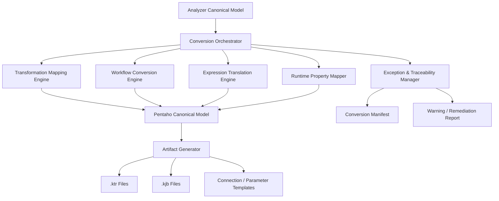

# X2XConverter Proposal  
## Informatica to Pentaho Conversion Engine

## 1. Executive Summary

X2XConverter 係 Travinto migration framework 入面負責實際轉換嘅核心引擎，目標係將 Informatica ETL artifacts 轉換成 Pentaho 可執行嘅 jobs 同 transformations，同時盡可能保留原有流程嘅 ETL semantics、欄位邏輯、控制流同 runtime 行為。

X2XConverter 並唔係單純做 XML-to-XML copy，而係透過 **canonical model + mapping engine + rule-based generation** 方式，實現可維護、可追蹤、可審計嘅 enterprise-grade migration。

---

## 2. Business Objective

X2XConverter 嘅主要商業目標包括：

- 加速 Informatica → Pentaho migration
- 提高標準 ETL pattern 自動化轉換比例
- 降低人工重建工作量
- 保留 ETL semantic consistency
- 為 validation 同 go-live 提供 traceable output

---

## 3. Conversion Scope

轉換範圍包括：

- Mappings
- Sessions
- Workflows
- Tasks
- Parameters / Variables
- Source / Target definitions
- Field mappings
- Transformation logic
- Control flow / dependency sequence
- Runtime settings
- Connection templates

---

## 4. Input

### 4.1 Required Input

- X2XAnalyzer 輸出嘅 canonical model
- Informatica 原始 XML / metadata
- Informatica version information
- Pentaho target version information
- Transformation mapping catalog
- Compatibility matrix
- Environment mapping configuration

### 4.2 Optional Input

- Manual override rules
- Naming standard
- Deployment structure
- Shared connection templates
- Custom migration exceptions list

---

## 5. Conversion Approach

### 5.1 Canonical-to-Canonical Strategy

建議採用：

**Informatica XML → Canonical Model → Pentaho Model → Pentaho XML**

而唔係直接做 vendor XML string transformation。

咁樣可以：

- 提高 maintainability
- 支援多版本
- 易於測試
- 容易加入其他 target platform
- 提供 traceability

### 5.2 Transformation Mapping

每個 Informatica transformation 會按以下方式處理：

- 1:1 direct mapping
- 1:n pattern mapping
- n:1 consolidation mapping
- Unsupported / manual remediation

### 5.3 Field-Level Translation

包括：

- datatype mapping
- expression translation
- null handling alignment
- default value logic
- casting / formatting behavior
- lookup return semantics
- derived field generation

### 5.4 Workflow & Control Flow Conversion

包括：

- Workflow → Pentaho Job
- Session → Transformation invocation
- Task dependency → Hop / execution sequence
- Conditional branch → success / failure path
- Parameter passing → variable / parameter injection

### 5.5 Runtime Property Conversion

包括：

- Commit size
- Error threshold
- Logging level
- Reject handling
- Cache behavior
- Sort requirement
- Parallelism / partitioning
- Retry / restart semantics（如目標平台可支援）

### 5.6 Exception Packaging

對於無法完全自動轉換項目，系統會標示：

- Unsupported transformation
- Manual SQL review required
- Runtime semantic mismatch
- Custom code migration required
- Redesign required

---

## 6. Output

### 6.1 Primary Deliverables

- Pentaho `.ktr` transformation files
- Pentaho `.kjb` job files
- Database connection templates
- Parameter / variable templates
- Conversion manifest
- Warning / remediation report
- Traceability report

### 6.2 Traceability Output

每個 generated object 建議保留：

- Source Informatica object reference
- Applied conversion rule ID
- Generation timestamp
- Warning / fallback decision
- Manual override history

---

## 7. Informatica → Pentaho Transformation Mapping Matrix

| Informatica Transformation | Pentaho Equivalent | Mapping Type | 注意事項 |
|---|---|---|---|
| Source Qualifier | Table Input / Table Input + SQL pattern | 1:1 / pattern | 視 SQL pushdown 同 source query 複雜度 |
| Expression | Calculator / Formula / Modified JavaScript Value / UDJC | 1:n | 視表達式複雜度與函數兼容性 |
| Filter | Filter Rows | 1:1 | 條件語法需轉換 |
| Router | Filter Rows + multiple hops | 1:n | 需建立多分支控制 |
| Lookup | DB Lookup / Stream Lookup | 1:n | 視 lookup source、cache 同 return logic |
| Joiner | Merge Join / Database Join / Stream Join pattern | 1:n | 視排序需求同 join source 類型 |
| Aggregator | Group By | 1:1 | 注意 null/group semantics |
| Sorter | Sort Rows | 1:1 | 注意 collation / sort behavior |
| Sequence Generator | Add Sequence | 1:1 | 視 sequence generation strategy |
| Rank | Sort Rows + Row Normaliser / custom logic | pattern | 可能需要組合步驟 |
| Update Strategy | Insert/Update / Delete / Switch pattern | pattern | 常需手動 review |
| Normalizer | Row Normaliser / custom reshape pattern | pattern | 視資料結構 |
| Union Transformation | Append Streams | 1:1 | 需確保 schema 一致 |
| Transaction Control | custom control pattern | pattern | Pentaho 未必有 direct equivalent |
| XML Source Qualifier | XML Input Stream / XML Input | 1:n | 視 XML structure |
| Stored Procedure | SQL / DB procedure invocation | pattern | 視 target runtime 支援 |
| Java Transformation / Custom | UDJC / custom plugin / manual rewrite | manual | 高風險項目 |
| Target Definition | Table Output / Bulk Loader / File Output | 1:1 / pattern | 視 load strategy |

---

## 8. Implementation Approach

### 8.1 Core Components

- **Canonical Model Reader**
- **Transformation Mapping Engine**
- **Expression Translation Engine**
- **Workflow Conversion Engine**
- **Pentaho Artifact Generator**
- **Exception & Traceability Manager**

### 8.2 Expression Translation Engine

對複雜表達式唔建議用 string replace，建議：

- tokenizer
- parser
- AST builder
- target expression renderer

咁樣先可以更穩定處理：

- nested function
- conditional logic
- datatype conversion
- null handling
- custom expression normalization

### 8.3 Artifact Generation

建議以 template-based 或 object-serialization 方式生成 Pentaho artifact：

- Step template
- Job entry template
- Hop template
- Connection template
- Parameter template

### 8.4 Manual Override Framework

建議支援以下 override：

- object-level override
- transformation-level override
- field-level override
- runtime property override
- environment mapping override

### 8.5 Recommended Technology

- Backend: Java / Kotlin
- Parser: JAXB / Jackson XML
- Expression Parser: ANTLR / custom parser
- Config: YAML / JSON
- Manifest / Traceability Store: SQLite / JSON / PostgreSQL
- Artifact Generator: XML serializer / template engine

---

## 9. System Architecture Diagram

---

## 10. Value to Customer

X2XConverter 為客戶提供：

- 更高自動化轉換比例
- 更一致嘅 migration output
- 更低人工重建成本
- 清晰 traceability
- 更容易做驗證同審計

最重要係，客戶唔需要由零開始手工喺 Pentaho 重建每條 ETL 流程。

---

## 11. Conclusion

X2XConverter 係 migration execution 核心，成功關鍵唔在於「可唔可以產生 XML」，而在於：

- 可唔可以保留 ETL 語意
- 可唔可以產生可運行 artifact
- 可唔可以清楚標示 unsupported / manual remediation
- 可唔可以同 validation framework 無縫銜接

呢個模組係整個 migration platform 入面最具技術深度同業務價值嘅部分。