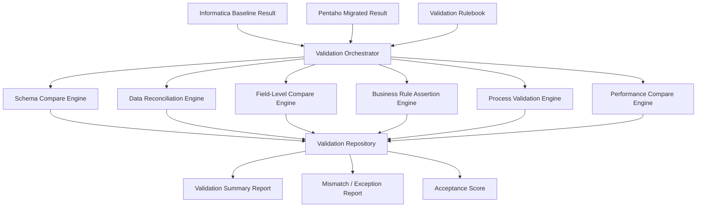

# X2XValidator Proposal  
## Migration Validation & Data Reconciliation Framework

## 1. Executive Summary

X2XValidator 係 Travinto migration framework 入面最後一個關鍵模組，主要目標係驗證由 Informatica 轉換去 Pentaho 之後，資料結果、欄位邏輯、業務規則、流程控制同埋整體執行表現是否符合預期。

對 management 而言，X2XValidator 提供嘅唔單止係 technical check，而係 migration quality assurance 同 go-live confidence。

---

## 2. Business Objective

X2XValidator 嘅主要商業目標包括：

- 驗證 migrated ETL output 是否與原系統一致
- 降低 production cutover 風險
- 提供可審計 validation evidence
- 加快 UAT / signoff 流程
- 建立 migration acceptance baseline

---

## 3. Validation Scope

驗證範圍包括：

- Schema consistency
- Row count consistency
- Field-level value comparison
- Aggregate / checksum comparison
- Business rule validation
- Process flow validation
- Runtime / performance comparison

---

## 4. Input

### 4.1 Required Input

- 原 Informatica metadata
- 已轉換 Pentaho metadata
- Source dataset
- Target dataset
- Baseline execution result（Informatica）
- Migrated execution result（Pentaho）
- Validation rulebook
- Schema mapping
- Key field definition
- Tolerance thresholds

### 4.2 Optional Input

- Historical runtime logs
- Golden sample dataset
- SLA / performance benchmark
- Exception whitelist
- Business validation scenarios

---

## 5. Validation Process

### 5.1 Validation Scope Definition

首先定義每條流程 / job 需要做邊幾層驗證：

- Schema-level
- Record-level
- Field-level
- Aggregate-level
- Business-rule-level
- Process-level
- Performance-level

### 5.2 Schema Validation

檢查：

- Table / file structure
- Field names
- Datatype alignment
- Length / precision / scale
- Nullable / default behavior

### 5.3 Data Reconciliation

比較：

- Row count
- Distinct count
- Null count
- Min / Max
- Sum / Avg
- Checksum / hash
- Key match rate
- Duplicate / unmatched records

### 5.4 Field-Level Comparison

逐欄位驗證：

- Exact match
- Tolerance match（例如 decimal、timestamp）
- Derived value correctness
- Lookup enrichment correctness
- Code mapping correctness

### 5.5 Business Rule Validation

確認重要 ETL business logic 冇走樣：

- Conditional routing
- Aggregation correctness
- Update / insert decision logic
- Reject handling
- Exception classification
- Enrichment logic consistency

### 5.6 Process Validation

驗證 execution flow：

- Job execution order
- Dependency correctness
- Branching behavior
- Parameter passing
- Logging / error behavior
- Restart / rerun behavior

### 5.7 Performance Validation

比較：

- Total runtime
- Throughput
- DB read/write time
- Bottleneck step
- Resource consumption pattern（如可用）

### 5.8 Exception Classification

將 mismatch 分類為：

- Expected difference
- Configuration issue
- Conversion issue
- Source timing issue
- Environment issue
- Business rule mismatch

---

## 6. Output

### 6.1 Primary Deliverables

- Validation Summary Report
- Schema Validation Report
- Data Reconciliation Report
- Field-Level Mismatch Report
- Business Rule Validation Report
- Process Validation Checklist
- Performance Comparison Report
- Migration Acceptance Score

### 6.2 Validation Status Classification

每個 job / object 可標示為：

- Passed
- Passed with Warning
- Failed
- Manual Review Required

---

## 7. Implementation Approach

### 7.1 Core Components

- **Validation Rulebook**
- **Metadata Compare Engine**
- **Dataset Profiling Engine**
- **Row / Field Comparison Engine**
- **Business Rule Assertion Engine**
- **Performance Comparison Engine**
- **Validation Report Generator**

### 7.2 Validation Strategy

建議支援兩種模式：

#### A. Fast Validation
- Sampling compare
- Row count compare
- Aggregate compare
- High-risk field compare

#### B. Full Validation
- Full reconciliation
- Key-based row compare
- Field-level compare
- Full business-rule assertions

### 7.3 Rulebook Design

Rulebook 建議包括：

- schema compare rules
- datatype tolerance rules
- key matching rules
- aggregate parity rules
- business assertions
- performance threshold rules

### 7.4 Data Access Abstraction

建議以統一 connector layer 支援：

- Oracle
- SQL Server
- DB2
- MySQL
- PostgreSQL
- CSV / Flat file
- Parquet（如有需要）

### 7.5 Recommended Technology

- Validation Engine: Python / Java
- Data Compare: SQL-based engine / Spark / Pandas
- Reporting: Markdown / HTML / PDF / Excel
- Dashboard: optional BI / operational dashboard
- Scheduling: integrated migration pipeline / CI-CD

---

## 8. System Architecture Diagram

---

## 9. Value to Customer

X2XValidator 幫客戶做到：

- 用數據證明 migration 成功
- 提升 UAT 同 signoff 信心
- 降低 cutover 風險
- 加快問題定位
- 為 production go-live 提供 audit trail

呢個模組特別適合有以下要求嘅 enterprise 客戶：

- 高資料準確度要求
- 有合規 / 審計需要
- 多批次 migration
- 需要可量化 acceptance standard

---

## 10. Conclusion

Migration 成功唔應該只以「轉到 Pentaho 可運行」作標準，而係要證明：

- 資料結果一致
- 商業邏輯一致
- 流程控制一致
- 表現達到可接受水平

X2XValidator 就係確保 migration quality、降低 business risk、支援 go-live signoff 嘅最後一道關鍵能力。

佢令整個 **Analyze → Convert → Validate** migration pipeline 成為一個真正可交付、可審計、可落地嘅 enterprise solution。